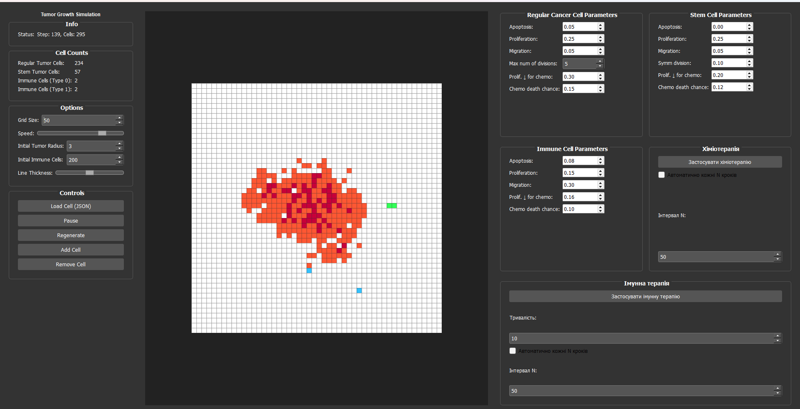

# Cancer Cellular Automata
Цей проєкт моделює ріст пухлини за допомогою клітинного автомата. Кожна клітина поводиться як автомат зі станами. Симуляція дозволяє досліджувати ефекти хіміо- та імунотерапії, адаптивних змін та AI-додавання клітин.

## Завантаження та запуск
1. Клонуйте репозиторій:
```bash
   git clone https://github.com/your-username/cancer-cellular-automata.git
```

3. Перейдіть в деректорію проєкту:
```bash
   cd cancer-cellular-automata
```

2. Встановіть залежності:
```bash
   pip install -r requirements.txt
```

3. Запустіть основну програму:
```bash
   python main.py
```

## Основні компоненти
- `main.py` —  головний скрипт, який запускає симуляцію
- `cells.py` —  містить логіку клітин
- `grid.py` —  відповідає за просторову сітку, в якій розміщуються клітини, та її оновлення
- `visualization.py` — модуль, що відповідає за візуалізацію

## Типи клітин
У моделі використано три основні типи клітин:

### Ракові клітини (RTC, STC)
- RTC (Regular Tumor Cell) — звичайні ракові клітини з обмеженою кількістю поділів.
- STC (Stem Tumor Cell) — стовбурові пухлинні клітини з потенціалом необмеженого поділу та можливістю симетричного поділу (утворення нової STC).

### Імунні клітини (IC)
- Можуть розпізнавати й атакувати ракові клітини.
- Містять параметри ефективності атаки, старіння, вірогідності смерті після невдалого нападу.

### Порожні клітини (EMPTY)
Вільний простір, куди можуть переміщуватись або клонуватись інші клітини.

## Терапії

### Хіміотерапія
- Задається періодично, діє на пухлинні клітини
- Може застосовуватись вручну або автоматично з певним періодом

### Імунотерапія
- Посилює дію імунних клітин
- Збільшує шанс появи нових імунних клітин
- Може застосовуватись вручну або автоматично з певним періодом
- Має параметр тривалість дії, що задається через GUI

## Візуалізація та інтерактивний інтерфейс

У `visualization.py` додано розширений інтерфейс, який дає змогу не лише спостерігати за ростом пухлини, а й управляти симуляцією в реальному часі.

- **Зміна швидкості ітерацій.**  
  Використовується слайдер для налаштування інтервалу між кадрами (у мілісекундах).
  
- **Відображення статистики.**  
  Над полем виводиться поточна кількість клітин кожного типу: N_RTC, N_STC, N_IC.
  
- **Завантаження клітин з файлу.**  
  Кнопка «Load Cells» відкриває JSON-файл (наприклад, `cells.json`) з попередньо збереженими позиціями й типами клітин.
  
- **Генерація клітин за допомогою AI.**  
  Кнопка «AI Generate» викликає метод `ai_generate_cells()`, який на основі заданих параметрів (щільності, розміру пухлинного вогнища тощо) створює початковий розподіл клітин.
  
- **Терапевтичні інструменти.**
  - *Chemotherapy:* кнопка застосовує хіміотерапію до всіх пухлинних клітин, автоматично змінюючи коефіцієнти `PROLIFERATION_DECREASE` та `DEATH_CHEMOTERAPY_CHANCE`.
  - *Immunotherapy:* кнопка підсилює імунні клітини викликом методу `apply_immunotherapy()`.
  
- **Налаштування ймовірностей.**  
  Використовується текстове поле (TextBox) для динамічної зміни параметрів кожного типу клітини: p_apoptosis, p_proliferation, p_migration, p_symm, ...


Графічний інтерфейс користувача

## Генеративні клітини
Клітини можна створювати з індивідуальними властивостями за допомогою:
- JSON-файлів (наприклад: `custom_cell.json`)  
- AI-редактора (`cell_editor.py`)

Це дозволяє:
- задавати власні параметри (наприклад: ймовірності поділу/смерті/міграції);
- створювати нові типи клітин без зміни коду;
- значно розширити функціональність симуляції.

*Приклад (custom_cell.json)*:
```json
{
  "type": "immune",
  "name": "custom_cell",
  "color": [
    255,
    0,
    255
  ],
  "rates": {
    "apoptosis": 0.1,
    "proliferation": 0.7,
    "migration": 0.5
  }
}
```

## Команда
- **Богдан Засимович** — реалізація логіки ракових клітин та хіміотерапії.
- **Соломія Гадійчук** — розробка імунних клітин, реалізація імунотерапії.
- **Максим Дзьобан** — AI-генерація клітин із файлу та тексту, візуалізація.
- **Олексій Ласійчук** — реалізація графічної візуалізації симуляції.

## Структура проєкту
cancer-cellular-automata\
├── cell_editor.py\
├── cells.py\
├── grid.py\
├── immune_utils.py\
├── main.py\
├── README.md\
├── requirements.txt\
└── visualization.py

## Використані джерела
- [Cellular-automaton model for tumor growth dynamics: Virtualization of different scenarios](https://www.sciencedirect.com/science/article/pii/S0010482522011891?ref=pdf_download&fr=RR-2&rr=8800d112bd3635b1)
- [A cellular automata model of chemotherapy effects on tumour growth: targeting cancer and immune cells](https://www.tandfonline.com/doi/full/10.1080/13873954.2019.1571515#abstract)
